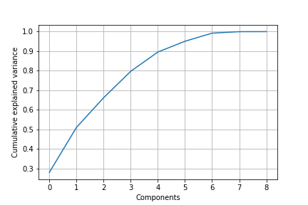
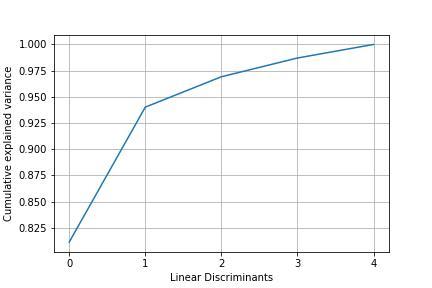

# Glass Type

Identification of the type of glass based on their oxide content i.e. Na, Fe, K, etc using **Dimensionality Reduction** with ***Principal Component Analysis*** and ***Linear Discriminant Analysis***.

---

## Background

* A large number of features in the dataset causes performance bottlenecks while developing machine learning models, A.K.A *Curse of Dimensionality*
* It affects both the training time as well as accuracy of machine learning models.
* To deal with huge number of features in the dataset we can perform **Dimensionality Reduction**.

### Dimensionality Reduction

* Extract the most important features from the dataset that are responsible for maximum variance in the output.
* Different statistical techniques are used for this purpose:
  * Linear Discriminant Analysis
  * Factor analysis
  * Principal Component Analysis

### Principal Component Analysis

* A statistical linear transformation technique
* An **unsupervised** learning
  * PCA has **no concern with the class labels** and summarizes the feature set without relying on the output.  
* **Converts high dimensional data to low dimensional data** by **selecting the most important features that capture maximum information** about the dataset.  
* The features are selected on the basis of **variance** that they cause in the output.  
  * The variance between the features doesn't depend upon the output.
* The feature that causes highest variance is the first principal component. The feature that is responsible for second highest variance is considered the second principal component, and so on.  
* The principal components do not have any correlation with each other.
* Advantages of PCA:
  * The training time of the algorithms reduces significantly with less number of features.
  * Data analysis becomes practically feasible as it is not always possible to analyze data in high dimensions.
* PCA is a statistical technique and can only be applied to numeric data.  
  * Categorical features are required to be converted into numerical features before PCA can be applied.

### Linear Discriminant Analysis

* A statistical linear transformation technique
* A **supervised** learning
  * It tries to reduce dimensions of the feature set while **retaining the information that discriminates output classes**.  
* It tries to **find a decision boundary around each cluster of a class**
* It then **projects the data points to new dimensions**
  * Clusters are as separate from each other as possible
  * Data points within a cluster are as close to the centroid of the cluster as possible
* The new dimensions are ranked on the basis of their ability to maximize the distance between the clusters and minimize the distance between the data points within a cluster and their centroids.
  * These new dimensions form the **linear discriminants** of the feature set.

#### Normalization of Features

* A feature set must be normalized before applying PCA or LDA. 
* If PCA is applied on such a feature set with high variance in values, the resultant loadings will also be large. Hence, principal components will be biased towards features with high variance, leading to false results.

---

## Dependencies

* Pandas
* Scikit-learn

`pip install -r requirements.txt`

## Dataset

Glass Identification data set in UCI archive: https://archive.ics.uci.edu/ml/datasets/glass+identification<br>
Saved in: *data/glass.data*

## Data Preprocessing

* Separate features and label
* Split data into Training and Test sets
  * Test size = 20%
* Normalize the feature set

## Dimensionality Reduction

### Principal Component Analysis

```
Variance % of principal components:

PC1 27.984201016028372
PC2 22.99658418680011
PC3 15.178480426262498
PC4 13.533617802759224
PC5 9.85827919213483
PC6 5.529001115624951
PC7 4.141466552377225
PC8 0.7589338046125045
PC9 0.01943590340029523
```



### Create, Train and Evaluate model with Principal Components

* Set principal components
* Prepare Random Forest Classifier for classification
* Grid Search using Cross Validation to find the best model

### Results

```
Principal Components: 4

Best parameters:
 {'bootstrap': True, 'criterion': 'entropy', 'n_estimators': 40}

Best training accuracy: 69.03%

Test Accuracy: 83.72%

Confusion matrix:
 [[11  0  0  0  0  0]
 [ 2 11  0  0  0  1]
 [ 2  0  1  0  0  0]
 [ 0  0  0  4  0  0]
 [ 0  0  0  0  2  1]
 [ 0  0  0  0  1  7]]
```

```
Principal Components: 5

Best parameters:
 {'bootstrap': True, 'criterion': 'entropy', 'n_estimators': 60}

Best training accuracy: 69.03%

Test Accuracy: 74.42%

Confusion matrix:
 [[10  1  0  0  0  0]
 [ 2 10  1  0  0  1]
 [ 2  1  0  0  0  0]
 [ 0  1  0  3  0  0]
 [ 0  0  0  0  2  1]
 [ 0  1  0  0  0  7]]
```

```
Principal Components: 6

Best parameters:
 {'bootstrap': False, 'criterion': 'gini', 'n_estimators': 10}

Best training accuracy: 70.20%

Test Accuracy: 79.07%

Confusion matrix:
 [[ 9  2  0  0  0  0]
 [ 3 10  0  1  0  0]
 [ 1  0  2  0  0  0]
 [ 0  1  0  3  0  0]
 [ 0  0  0  0  2  1]
 [ 0  0  0  0  0  8]]
```

```
Principal Components: 7

Best parameters:
 {'bootstrap': True, 'criterion': 'entropy', 'n_estimators': 80}

Best training accuracy: 67.85%

Test Accuracy: 79.07%

Confusion matrix:
 [[10  1  0  0  0  0]
 [ 2 10  0  1  0  1]
 [ 1  1  1  0  0  0]
 [ 0  1  0  3  0  0]
 [ 0  0  0  0  2  1]
 [ 0  0  0  0  0  8]]
```

 ---

### Linear Discriminant Analysis

```
Variance % of linear discriminants:

LD1 81.1221400450458
LD2 12.892560295638212
LD3 2.898297524886845
LD4 1.792269199324338
LD5 1.2947329351048067
```



### Create, Train and Evaluate model with Linear Discriminants

* Set linear discriminants
* Prepare Random Forest Classifier for classification
* Grid Search using Cross Validation to find the best model

### Results

```
Linear Discriminants: 3

Best parameters:
 {'bootstrap': True, 'criterion': 'entropy', 'n_estimators': 80}

Best training accuracy: 61.36%

Test Accuracy: 72.09%

Confusion matrix:
 [[ 9  2  0  0  0  0]
 [ 4 10  0  0  0  0]
 [ 1  2  0  0  0  0]
 [ 0  0  0  2  0  2]
 [ 0  1  0  0  2  0]
 [ 0  0  0  0  0  8]]
```

```
Linear Discriminants: 4

Best parameters:
 {'bootstrap': True, 'criterion': 'gini', 'n_estimators': 60}

Best training accuracy: 61.39%

Test Accuracy: 67.44%

Confusion matrix:
 [[9 2 0 0 0 0]
 [6 8 0 0 0 0]
 [2 0 1 0 0 0]
 [0 0 0 2 0 2]
 [0 0 0 0 1 2]
 [0 0 0 0 0 8]]
```

```
Linear Discriminants: 5

Best parameters:
 {'bootstrap': True, 'criterion': 'entropy', 'n_estimators': 60}

Best training accuracy: 63.18%

Test Accuracy: 72.09%

Confusion matrix:
 [[ 9  2  0  0  0  0]
 [ 4 10  0  0  0  0]
 [ 2  0  1  0  0  0]
 [ 0  0  0  2  0  2]
 [ 0  0  0  0  1  2]
 [ 0  0  0  0  0  8]]
```

---

## Conclusion

* In case of ***uniformly distributed data***, **LDA** almost always performs better than PCA.  
* In case of ***highly skewed irregularly distributed data*** then **PCA** should be used since LDA can be biased towards the majority class.
* **PCA can be applied to labeled as well as unlabeled data** since it doesn't rely on the output labels.  
* **LDA requires output classes for finding linear discriminants** and hence requires labeled data.
